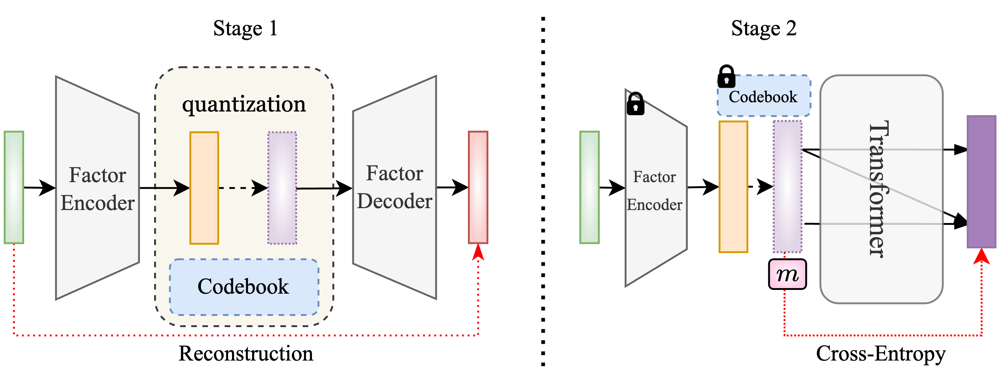

# FactorVQVAE: Discrete Latent Factor Model

PyTorch reproduction of **FactorVQVAE: Discrete latent factor model via Vector Quantized Variational Autoencoder**. The repository implements the two-stage VQ-VAE and autoregressive Transformer pipeline and provides configuration-driven experiments for CSI300 and SP500.

<div align="center">
  
</div>

## Pipeline

### Stage 1: VQ-VAE

Stage 1 learns a discrete representation of future returns:

```text
future return -> FactorEncoder -> VectorQuant -> code token
stock features + quantized factor -> FactorDecoder -> reconstructed return
```

Stage 1 uses seed 42 for both markets.

### Stage 2: autoregressive prior

The Stage 1 encoder, quantizer, and stock feature extractor are frozen. The Transformer predicts the target latent token from realized historical tokens and 13 market factors. The predicted code embedding is decoded into a return forecast.

The checkpoint is selected by the highest validation RankIC (`Val_RIC`). Early stopping is independently based on validation loss.

## Data

Each ordinary train/validation sample contains 172 columns:

```text
Alpha158 stock features (158)
+ JKP market factors (13)
+ normalized model label (1)
```

The test cache contains 173 columns:

```text
Alpha158 (158) + JKP13 (13) + model_label (1) + raw_label (1)
```

- `model_label` is processed by Qlib `CSRankNorm` and is used to generate latent tokens.
- `raw_label` is never passed to the model. It is retained only for IC, RankIC, and backtesting.
- The JKP CSV files must contain all 13 themes listed in `prepare_data.py` and are configured with `data.jkp_path`.

Expected JKP files in this reproduction:

```text
data/dataset/[chn]_[all_themes]_[daily]_[vw_cap].csv
data/dataset/[usa]_[all_themes]_[daily]_[vw_cap].csv
```

### Label and timing

The paper-style label is the return from trading day `t+1` to `t+2`:

```text
Ref($close, -2) / Ref($close, -1) - 1
```

Prediction is assumed to occur after the close of day `t`. Consequently, `label(t-1)` is not yet realized, and the most recent usable historical label is `label(t-2)`. Stage 2 enforces `transformer.label_delay: 2`; changing the unavailable `t-1` and `t` labels does not change model predictions.

Time-series windows use forward fill only. Backfill is rejected because it can copy a future row and its label into an earlier position.

### Splits

| Segment | Configured period |
|---|---|
| Train | 2009-01-01 to 2020-12-31 |
| Validation | 2021-01-01 to 2022-12-31 |
| Test | 2023-01-01 to 2025-12-31 |

The final two trading dates of train and validation are embargoed so that label realization does not cross a split boundary. The Qlib handler extends into January 2026 to calculate labels for the final 2025 prediction dates.

## Market configurations

| Market | Codebook | Transformer dim | Heads | Layers | Stage 1 seed | Stage 2 seeds |
|---|---:|---:|---:|---:|---:|---|
| CSI300 | 512 | 64 | 2 | 2 | 42 | 0, 1, 2, 3, 4 |
| SP500 | 128 | 32 | 4 | 2 | 42 | 0, 1, 2, 3, 4 |

The complete configurations are in:

```text
configs/csi300.yaml
configs/sp500.yaml
```

## Installation

The experiments in this repository were run in the Conda environment `factorvqvae`. Install the packages in `requirements.txt`, Qlib, TensorBoard, a CUDA-compatible PyTorch build, and VQTorch.

```bash
conda activate factorvqvae
pip install -r requirements.txt
```

VQTorch is available from [minyoungg/vqtorch](https://github.com/minyoungg/vqtorch). Qlib data setup is documented in [microsoft/qlib](https://github.com/microsoft/qlib).

The configured provider locations are:

```text
~/.qlib/qlib_data/cn_data
~/.qlib/qlib_data/us_data
```

## Usage

### Build cached datasets

```bash
python prepare_data.py --config configs/csi300.yaml
python prepare_data.py --config configs/sp500.yaml
```

Rebuild only selected segments:

```bash
python prepare_data.py --config configs/csi300.yaml --segments test
```

### Train Stage 1

```bash
python stage1.py --config configs/csi300.yaml
python stage1.py --config configs/sp500.yaml
```

Each command saves the best Stage 1 model as `stage1_best.ckpt` under the market-specific checkpoint directory.

### Train Stage 2

```bash
python stage2_gpt.py --config configs/csi300.yaml --seed 0
python stage2_gpt.py --config configs/sp500.yaml --seed 0
```

Run the configuration-driven wrapper:

```bash
python run_experiment.py \
  --config configs/csi300.yaml \
  --stages stage1 stage2 \
  --seeds 0 1 2 3 4
```

### Re-evaluate an existing checkpoint

Existing Stage 2 checkpoints can be evaluated without retraining:

```bash
python evaluate_stage2.py \
  --config configs/csi300.yaml \
  --checkpoint outputs/csi300/checkpoints/<checkpoint>.ckpt \
  --seed 0
```

### Outputs

```text
outputs/<market>/checkpoints/   best Stage 1 and Stage 2 checkpoints
outputs/<market>/tb_logs/       TensorBoard logs
outputs/<market>/results/       test prediction DataFrames
outputs/<market>/store/         serialized Stage 2 model
```

## Baseline Results Protocol v1.0

The repository also provides a non-invasive standardized evaluation layer. It reads the
existing prediction pickles, leaves all native outputs untouched, and reruns every seed
and raw-score ensemble with Qlib `TopkDropoutStrategy` (`topk=30`, `n_drop=5`) under the
protocol account, timing, and transaction-cost rules.

Generate and validate the comparable artifacts without retraining:

```bash
BASELINE_ID=factorvqvae python generate_baseline_results.py \
  --configs configs/csi300.yaml configs/sp500.yaml \
  --out results
BASELINE_ID=factorvqvae python inspect_eval_results.py --results results
```

The output layers have fixed roles:

```text
results/metrics/       numeric seed, aggregate, and ensemble metrics
results/tables/        four-decimal paper/README display tables
results/curves/        ensemble daily gross return, cost, net return, benchmark, and NAV
results/metadata/      actual evaluation configuration and manifest
results/diagnostics/   machine-readable validation report
```

Ranking metrics are daily cross-sectional Pearson IC and Spearman RankIC. Their IRs use
daily-series sample standard deviation (`ddof=1`) and are not annualized. Portfolio
metrics use daily net simple return (`Qlib return - cost`), log returns, annualization
252, sample volatility, zero risk-free rate/MAR, and a NAV that includes the origin 1.0.
`inspect_eval_results.py` independently reconstructs aggregates, tables, ensemble
ranking metrics, daily NAVs, and all ensemble portfolio metrics; exit status 0 means all
checks passed.

Comparability still depends on matching the prediction target, test period, universe,
and provider data version. This project predicts the close(t+1)-to-close(t+2) return
from a signal assigned to day t; Qlib consumes that signal at trade day t+1 through its
native `shift=1` strategy timing.

## Reproduction results

Test period: 2023-01-01 to 2025-12-31. Values below use raw future returns for evaluation and the highest-validation-RankIC checkpoint for each seed.

### CSI300

| Seed | IC | ICIR | RankIC | RankICIR |
|---:|---:|---:|---:|---:|
| 0 | 0.01358 | 0.08191 | 0.03981 | 0.26197 |
| 1 | 0.01149 | 0.06748 | 0.03807 | 0.24168 |
| 2 | 0.01290 | 0.07691 | 0.04040 | 0.25988 |
| 3 | 0.01357 | 0.08183 | 0.04075 | 0.26498 |
| 4 | 0.01250 | 0.07307 | 0.03976 | 0.24906 |
| **Mean** | **0.01281** | **0.07624** | **0.03976** | **0.25551** |
| **Std** | **0.00078** | **0.00549** | **0.00092** | **0.00876** |

### SP500

| Seed | IC | ICIR | RankIC | RankICIR |
|---:|---:|---:|---:|---:|
| 0 | 0.00099 | 0.00801 | 0.00625 | 0.04735 |
| 1 | 0.00049 | 0.00405 | 0.00324 | 0.02412 |
| 2 | 0.00159 | 0.01315 | 0.00388 | 0.02917 |
| 3 | 0.00374 | 0.02934 | 0.00652 | 0.04666 |
| 4 | -0.00555 | -0.05412 | -0.00229 | -0.02026 |
| **Mean** | **0.00025** | **0.00009** | **0.00352** | **0.02541** |
| **Std** | **0.00311** | **0.02844** | **0.00318** | **0.02463** |

CSI300 is stable across seeds. SP500 is substantially weaker and more seed-sensitive under the current configuration.

## Project structure

```text
configs/                 market-specific experiment configurations
data/                    dataset helpers, JKP inputs, and generated caches
module/                  VQ-VAE and Transformer implementations
trainer/                 PyTorch Lightning training modules
utils/                   metrics, inference, and utility functions
prepare_data.py          build leakage-safe Qlib caches
stage1.py                train VQ-VAE
stage2_gpt.py            train autoregressive latent prior
evaluate_stage2.py       evaluate an existing Stage 2 checkpoint
run_experiment.py        configuration-driven experiment wrapper
```

## Citation

```bibtex
@article{kim2025factorvqvae,
  title={FactorVQVAE: Discrete latent factor model via Vector Quantized Variational Autoencoder},
  author={Kim, Namhyoung and Ock, Seung Eun and Song, Jae Wook},
  journal={Knowledge-Based Systems},
  volume={318},
  pages={113460},
  year={2025},
  publisher={Elsevier}
}
```

## Acknowledgments

- [VQTorch](https://github.com/minyoungg/vqtorch)
- [minGPT](https://github.com/karpathy/minGPT)
- [Qlib](https://github.com/microsoft/qlib)
